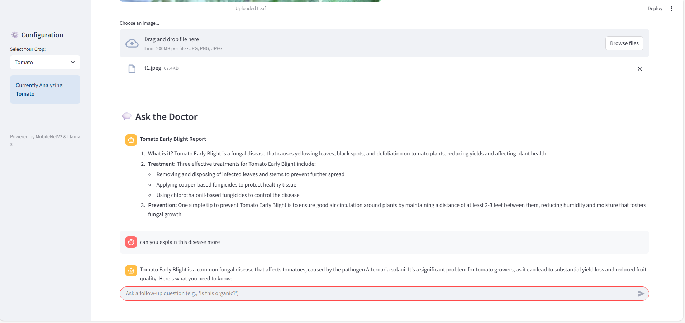

# 🌿 Agri-Doctor: AI-Powered Crop Disease Detective


## 📖 Overview
**Agri-Doctor** is an end-to-end AI application designed to assist farmers in early detection and treatment of crop diseases. Agriculture is the backbone of many economies, yet farmers lose significant yields annually due to untreated or misdiagnosed plant diseases.

This project bridges the gap between complex technology and the farm field. By simply uploading a photo of a leaf, the system identifies the specific disease and—crucially—provides an instant, actionable prescription (chemical and organic) using a Large Language Model (LLM).

---

## 🚀 Key Features
* **Multi-Crop Support:** Specialized diagnosis for **Rice, Sugarcane, Tomato, and Grapes**
* **Hybrid AI Architecture**
  * **Vision:** Fine-tuned **MobileNetV2 (CNN)** for classifying 23 disease classes
  * **Language:** **Groq API (Llama-3-70B)** for human-readable diagnosis and treatment
* **Smart Logic Filter:** Prevents crop misclassification (e.g., Rice vs. Sugarcane leaves)
* **Interactive Chat:** Ask follow-up questions to the AI Doctor and receive contextual answers

---

## 🛠️ Tech Stack
* **Deep Learning:** TensorFlow, Keras (Transfer Learning – MobileNetV2)
* **Generative AI:** Groq API (Llama-3)
* **Web Framework:** Streamlit
* **Image Processing:** PIL, NumPy

---

## 📊 Dataset & Model Results
* Combined **PlantVillage Dataset** + custom web-scraped images
* **Total Classes:** 23 (Healthy + Diseased)
* **Training Accuracy:** ~80%
* **Validation Accuracy:** ~78%
* **Optimizations:** Data augmentation, `tf.data.AUTOTUNE`, fine-tuned top layers

---

## 🧠 How It Works
1. **Select Crop** – Choose the crop type from the sidebar
2. **Upload Image** – Upload a photo of the affected leaf
3. **AI Diagnosis**
   * CNN predicts the disease
   * Logic filter validates crop–disease consistency
4. **Prescription**
   * LLM generates cause, treatment, and prevention steps

---

## 📱 App Screenshots
> Add your screenshots in a `screenshots/` folder

### 1️⃣ Disease Diagnosis & Medical Prescription


### 2️⃣ AI Doctor Chat Interface


---

## ⚙️ Installation & Setup

### Prerequisites
* Python 3.8+
* Free **Groq API Key**

### 1. Clone the Repository
```bash
git clone https://github.com/your-username/Agri-Doctor.git
cd Agri-Doctor```

2. Install Dependencies
pip install -r requirements.txt
3. Set Up API Key (Securely)
mkdir .streamlit
notepad .streamlit/secrets.toml
Inside secrets.toml:

GROQ_API_KEY = "gsk_your_key_here"
4. Run the App
python -m streamlit run app.py
📂 Project Structure
Agri-Doctor/
├── MultiCrop_Doctor_v1.keras
├── app.py
├── requirements.txt
├── README.md
├── screenshots/
│   ├── diagnosis.png
│   └── chat.png
└── .streamlit/
    └── secrets.toml
🔮 Future Scope
📱 TensorFlow Lite Android App

🌐 Hindi & Regional Language Support

🧮 Fertilizer & NPK Calculator

🤝 Contributing
Pull requests are welcome! Fork this repository and submit your improvements.

